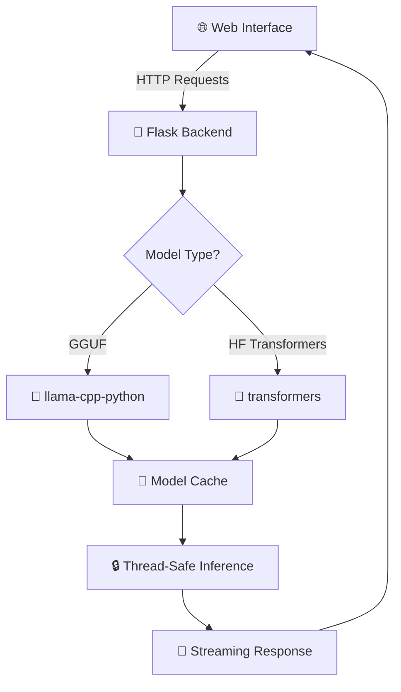

# 🚀 Local AI Studio
### *Your Personal LLM Chat Engine*

<div align="center">

[](https://www.python.org/)
[](https://opensource.org/licenses/MIT)
[](https://flask.palletsprojects.com/)
[](https://huggingface.co/transformers/)

*A versatile, locally hostable chat engine that brings the power of Large Language Models to your fingertips*

[🎯 Features](#-features) • [🚀 Quick Start](#-installation) • [📖 Usage](#-usage) • [🔧 API](#-api-endpoints) • [🤝 Contributing](#-contributing)

</div>

---

## 🎯 Features

<table>
<tr>
<td width="50%">

### 🧠 **Multi-Model Support**
- **GGUF Models** via `llama-cpp-python`
- **Hugging Face Transformers** (full & quantized)
- **Local & Hub Models** seamlessly integrated

### ⚡ **Performance Optimized**
- **GPU Acceleration** (CUDA/Metal support)
- **Dynamic Model Loading** with intelligent caching
- **Thread-Safe Inference** for production use
- **Streaming Responses** for real-time interaction

</td>
<td width="50%">

### 🎨 **Modern Web Interface**
- **Clean, Responsive UI** built with vanilla JS
- **Real-time Parameter Adjustment**
- **Session Management** with chat history
- **Mobile-Friendly Design**

### 🛠️ **Developer Friendly**
- **REST API** with Postman collection
- **Jupyter Notebooks** for experimentation
- **Easy Configuration** via JSON files
- **Comprehensive Documentation**

</td>
</tr>
</table>

---

## 🏗️ Architecture



---

## 🚀 Installation

### Prerequisites

> **💡 Pro Tip:** Use a virtual environment to keep your system clean!

- 🐍 **Python 3.9+**
- 📦 **pip** and virtual environment manager
- 🎮 **GPU (Optional)**: NVIDIA CUDA / Apple Metal / AMD ROCm

### Quick Setup

```bash
# 1️⃣ Clone the repository
git clone https://github.com/SakibAhmedShuva/Local-LLM-Chat-Engine.git
cd Local-LLM-Chat-Engine

# 2️⃣ Create virtual environment
python -m venv venv

# Windows
.\venv\Scripts\activate
# macOS/Linux
source venv/bin/activate

# 3️⃣ Install dependencies
pip install -r requirements.txt
```

### 🎮 GPU Acceleration Setup

<details>
<summary><b>🔥 NVIDIA CUDA Setup</b></summary>

```bash
# Uninstall CPU-only version
pip uninstall llama-cpp-python -y

# Install with CUDA support
set CMAKE_ARGS=-DLLAMA_CUBLAS=on 
pip install --upgrade --force-reinstall llama-cpp-python --no-cache-dir
```

**Requirements:**
- CUDA Toolkit installed
- Updated GPU drivers

</details>

<details>
<summary><b>🍎 Apple Metal Setup</b></summary>

```bash
# Uninstall CPU-only version
pip uninstall llama-cpp-python -y

# Install with Metal support
set CMAKE_ARGS=-DLLAMA_METAL=on 
pip install --upgrade --force-reinstall llama-cpp-python --no-cache-dir
```

**Works on:** M1, M2, M3 Mac devices

</details>

### 🔐 Environment Setup

Create a `.env` file in the project root:

```env
HUGGING_FACE_HUB_TOKEN=your_hf_token_here
```

> **Note:** The HF token is optional but recommended for private/gated models.

---

## 🗂️ Project Structure

```
Local-LLM-Chat-Engine/
├── 🏠 app.py                     # Main Flask application
├── 🦙 gguf_handler.py           # GGUF model logic
├── 🤗 regular_handler.py        # HF Transformers logic
├── 🌐 index.html               # Frontend UI
├── ⚙️ online_models.json        # Hub model definitions
├── 📮 postman_collection.json  # API testing collection
├── 📦 requirements.txt         # Dependencies
├── 📁 models/
│   ├── 🦙 gguf/               # Place .gguf files here
│   └── 🤗 regular/            # Place HF model dirs here
└── 📓 notebooks/
    ├── gguf_inference.ipynb
    └── series_question.ipynb
```

---

## 🛠️ Model Setup

### 📍 Local Models

| Model Type | Location | Description |
|------------|----------|-------------|
| **GGUF** | `./models/gguf/` | Place `.gguf` files directly |
| **HF Models** | `./models/regular/` | Complete model directories |

### 🌐 Hub Models

Create `online_models.json` to define downloadable models:

<details>
<summary><b>📋 Example Configuration</b></summary>

```json
[
  {
    "id": "gguf_hub_zephyr7b_q4",
    "name": "Zephyr 7B Beta (Q4 GGUF Hub)",
    "type": "gguf",
    "source_type": "hub",
    "repo_id": "TheBloke/zephyr-7B-beta-GGUF",
    "filename": "zephyr-7b-beta.Q4_K_M.gguf",
    "params": {
      "n_ctx": 4096,
      "n_gpu_layers_default": -1,
      "default_max_tokens": 1024,
      "default_temperature": 0.7
    }
  },
  {
    "id": "hf_hub_distilgpt2",
    "name": "DistilGPT-2 (HF Hub)",
    "type": "regular",
    "source_type": "hub",
    "path": "distilgpt2",
    "params": {
      "default_max_new_tokens": 256,
      "default_temperature": 0.8,
      "trust_remote_code_default": true
    }
  }
]
```

</details>

---

## 🎮 Usage

### 🚀 Starting the Server

```bash
python app.py
```

🌐 **Access the UI:** http://localhost:5000

### 💬 Web Interface Guide

<table>
<tr>
<td width="33%">

#### 🎯 **Model Selection**
- Choose from dropdown
- Auto-loads parameters
- Supports local & hub models

</td>
<td width="33%">

#### ⚙️ **Parameter Tuning**
- **Temperature**: Creativity level
- **Max Tokens**: Response length
- **Top-K/Top-P**: Sampling control
- **GPU Layers**: Performance boost

</td>
<td width="33%">

#### 💾 **Session Management**
- **New Chat**: Fresh conversation
- **History**: Browse past chats
- **Clear Memory**: Reset context
- **Auto-save**: Never lose progress

</td>
</tr>
</table>

### 🎛️ Key Controls

| Button | Function |
|--------|----------|
| 🆕 **New Chat** | Start fresh conversation |
| 🧠 **Clear Memory** | Reset model context |
| 🔄 **Reset Settings** | Restore default parameters |
| 📤 **Run** | Send message |

---

## 🔧 API Endpoints

<details>
<summary><b>📡 Available Endpoints</b></summary>

### **GET** `/models`
Get all available models
```json
Response: [{"id": "model1", "name": "Model 1", ...}]
```

### **POST** `/create-session`
Create new session
```json
Response: {"status": "success", "session_id": "uuid"}
```

### **POST** `/chat`
Send chat message (streaming response)
```json
{
  "session_id": "your-session-id",
  "model_id": "selected_model_id",
  "prompt": "Your message",
  "system_prompt": "Optional system prompt",
  "temperature": 0.7,
  "model_load_params": {},
  "model_specific_params": {}
}
```

### **POST** `/clear-backend-history`
Clear session history
```json
{"session_id": "your-session-id"}
```

</details>

---

## 🧪 Development Tools

### 📮 **Postman Collection**
Use `postman_collection.json` for API testing

### 📓 **Jupyter Notebooks**
- `gguf_inference.ipynb` - GGUF model testing
- `series_question.ipynb` - API interaction examples

### 🔒 **Thread Safety**
Built-in locking mechanism for GGUF models ensures safe concurrent access

---

## 🚀 Coming Soon

<div align="center">

| Feature | Status |
|---------|--------|
| 🎤 **Speech-to-Text** | 🚧 Coming Soon |
| 🔊 **Text-to-Speech** | 🚧 Coming Soon |
| 🔍 **RAG Integration** | 💭 Planned |
| 📊 **Model Analytics** | 💭 Planned |

</div>

---

## 🤝 Contributing

We welcome contributions! Here's how you can help:

<table>
<tr>
<td width="50%">

### 🐛 **Bug Reports**
- Use GitHub Issues
- Include system info
- Provide reproduction steps

### 💡 **Feature Requests**
- Describe the use case
- Explain expected behavior
- Consider implementation impact

</td>
<td width="50%">

### 🔧 **Code Contributions**
1. Fork the repository
2. Create feature branch
3. Make your changes
4. Add tests if applicable
5. Submit pull request

### 📖 **Documentation**
- Fix typos
- Add examples
- Improve clarity

</td>
</tr>
</table>

---

## 📄 License

This project is licensed under the **MIT License** - see the [LICENSE](LICENSE) file for details.

---

## 🙏 Acknowledgements

<div align="center">

**Built with ❤️ using amazing open-source projects:**

[](https://github.com/abetlen/llama-cpp-python)
[](https://huggingface.co/transformers/)
[](https://flask.palletsprojects.com/)
[](https://www.llamaindex.ai/)

</div>

---

<div align="center">

**⭐ Star this repo if you find it useful! ⭐**

**Made with 💻 and ☕ by the community**

</div>
